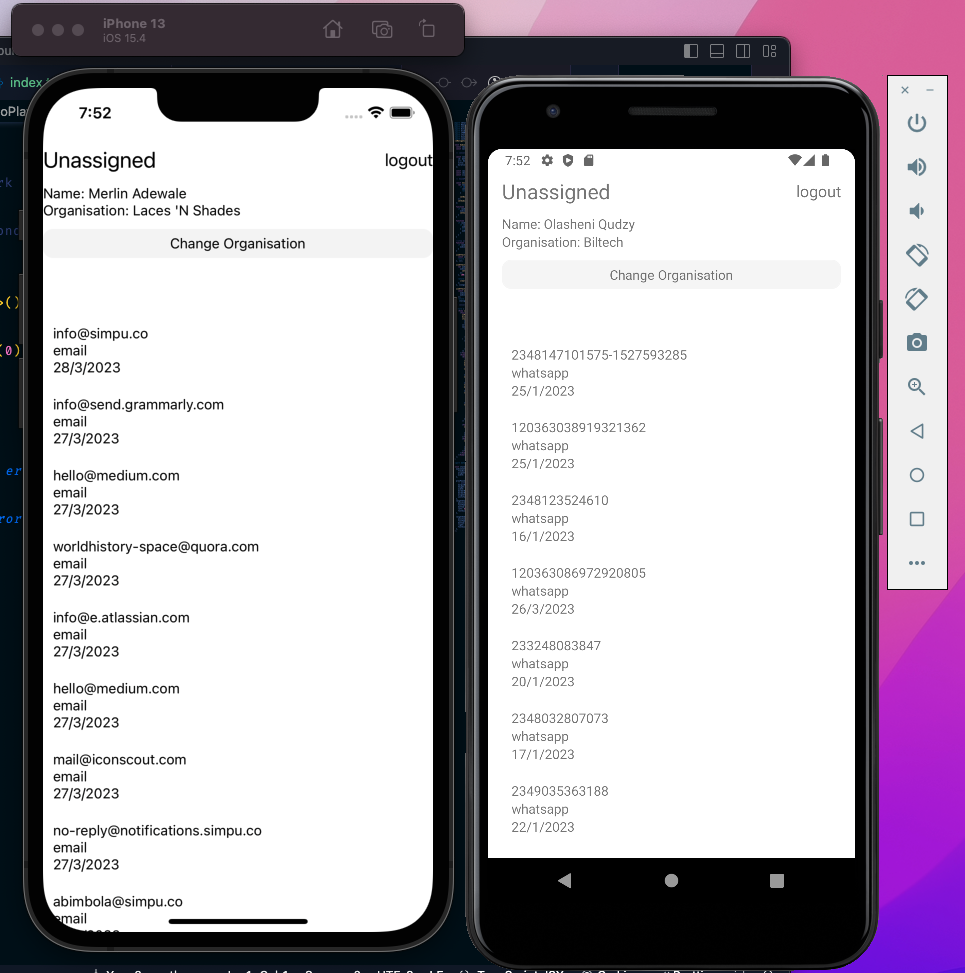
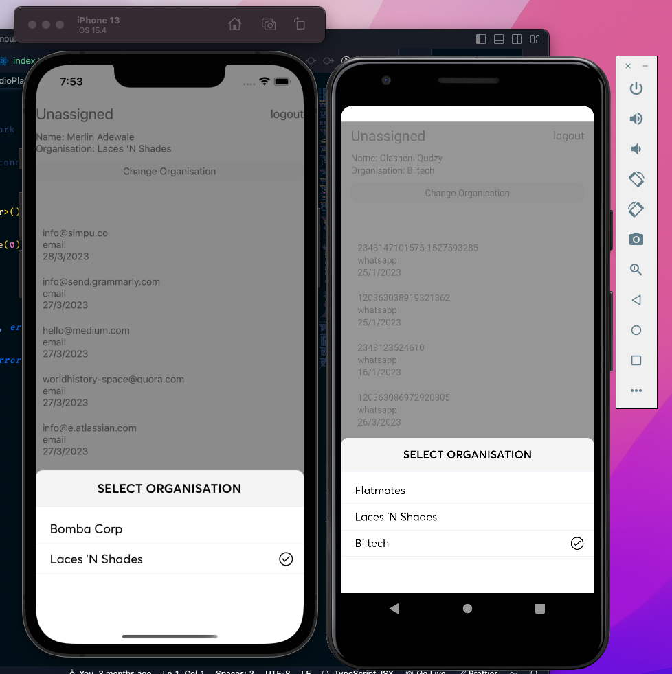

# Simpu Mobile (Sample for pusher intgration)

This repository contains the sample source code for the project Simpu Mobile customer platform, This repo is to test and debugg crashes caused by pusherJS

##Platform
Occurs on both android and ios.

1. An instance of pusher was created and exported on line 37 of [index.tsx](src/index.tsx)

   ```
   export const pusher = Pusher.getInstance();

   ```

2. Pusher connection was created and Initialized on line 48 of [src/navigation/index.tsx](src/navigation/index.tsx)

```
export const pusher = Pusher.getInstance();
```

3. Channels are subscribed to on line 64 to line 86 of [src/navigation/index.tsx](src/navigation/index.tsx)

```
      // //subscribe to organisation
      const orgChannelName = `presence-organisation-${organisation?.id}`;
      const organisationChannel = await pusher.subscribe({
        channelName: orgChannelName,
        onEvent: event => {
          console.log(`org channel event:`, JSON.stringify(event, null, 2));
        },
      });

      // subscribe to live chat
      const liveChatChannelName = `presence-livechat-${organisation?.id}`;

      const LiveChatChannel = await pusher.subscribe({
        channelName: liveChatChannelName,
        onEvent: event => {
          console.log(
            `liveChat channel event:`,
            JSON.stringify(event, null, 2),
          );
        },
      });

      //subscribe to profile
      const userChannelName = `private-profile-${profile?.id}`;
      const userChannel = await pusher.subscribe({
        channelName: userChannelName,
        onEvent: event => {
          console.log(
            `userChanel channel event:`,
            JSON.stringify(event, null, 2),
          );
        },
      });
```

4. Events are listened for on line 114 of [src/navigation/index.tsx](src/navigation/index.tsx)

```
  const onEvent = async (event: any) => {
    const data = await JSON.parse(event?.data);
    const eventName = await event?.eventName;

    if (eventName === 'message_new') {
      RNBeep?.beep();
      // RNBeep.PlaySysSound(1);
      await queryClient.invalidateQueries('conversations');
      await queryClient.invalidateQueries('threads');
      await queryClient.invalidateQueries('filters-unread-count');
    }

    await queryClient.invalidateQueries('notifications-outline');
  };
```

5. organisation are re-subscribed to when user changes organisation(channel) line 136 of [src/screens/Message/index.tsx](src/screens/Message/index.tsx)

```
   //change organisaion
  const changeOrganisations = async (index: any) => {
    await UnsubscribeCurrentPusherChannel();
    dispatch(updateOrganisation(organisations[index]));
    setfetchProfile(true);
    closeSheet();
  };
```

## Motivation

Streamline all your chat channels into one powerful inbox. Sync WhatsApp, Twitter, Instagram, Messenger, SMS, iMessage, Website Chat, Telegram. Never lose a message again!

## Tech used

### Built with

- [React Native](https://reactnative.dev/)

## Requirements

`node`

`gem install cocoapods -v 1.10.1`

## Installation

`npm install`

### Setup vars for environment

**_copy .env.example file with the vars gave by the dev team_**

0. `cp .env.example .env`

1. Cloned off the feature/integration branch.

   ```bash
   git clone https://github.com/tdammy92/SImpu-abstract.git

   ```

2. Install dependencies.

   ```bash
   npm install
   ```

3. Start dependencies.

   ```bash
   npx react-native run-android
   ```

   ```bash
   npx react-native run-ios
   ```

4. iOS dependencies

   ```bash
    cd ios && pod install
   ```

5. Ask for the release.keystore

### Running the Application in development

To run the app during development. you will follow the process listed below

- start metro packager run the command below to start the packager in a separate
  terminal console

this must be done in the root directory

```bash
npm start -- --reset-cache
```

##Current crash issue

Note: App crashes after changing an organisation for the first time after login.

- Please kindly use the .env file sent to you.
- Use the login details sent to you for testing

Note:occurs frequently on IOS.
-Sample Page


- Select organisation
  

© [Simpu](https://www.simpu.co/)
